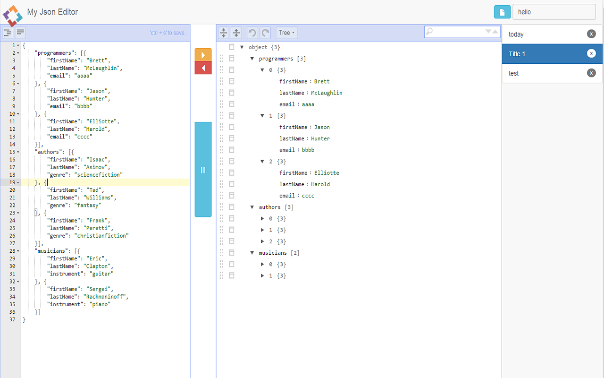

#What's this?

This is a json editor for online web editor(data stored in `window.localStorage`) and chrome plug(data stored in `chrome.storage.local`)

fast.
#Preview

news is the data stored on local disk . fast.

#Where the tool from?

This based [https://github.com/josdejong/jsoneditor](https://github.com/josdejong/jsoneditor)

#Develop

##Web

Your can reEdit the files:
`js/main.js`
`index.html`
`css/main.css`

##ChromeApp

You can reEdit the files:
`js/chrome.js`
`index.html`
`mainifest.json`
`css/main.css`
and your can reUse the images of folder `chromeapp`  

#License

Apache Licensed. See accompanying LICENSE file.
